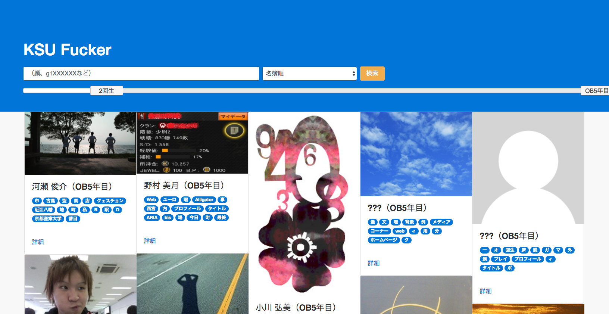

# KSU Fucker
京都産業大学の学生データベースです。WEBサイト[KSUFucker](http://ksufucker.herokuapp.com/)にアクセスすると、データベース検索が可能です。現段階では、学内のCCドメインから直接画像を読み込んでいるため、アクセス制限によって表示速度が遅いことがあります。また、バグが多々あります。

## クローラー
学生データベースは、主に以下のURLを再帰的に辿っていき、クローリングして、データを収集することで作成されています。

- http://www.cc.kyoto-su.ac.jp/~gX[学生証番号]/
- http://www.cse.kyoto-su.ac.jp/~gX[学生証番号]/

実際のところは、一度クローリングした後に、高頻度に出現するページを再度クロールすることによって、できる限り多くのデータを入手することに成功しています。詳しいダウンロード元は、`./analyze/dlconfig.py`に記入されています。

クローラーの詳しい情報は、[こちら](https://github.com/supertask/KSUFucker/tree/master/analyze)のソースコードとREADMMEをご覧ください。

## 動作環境
- サイト
	- メイン言語: PHP
	- WEBサーバー: Apache
- クローラー
	- メイン言語: Python
	- フレームワーク: dlib, MeCab, sqlite3, skimage, numpy, scipy
    - コマンド: wget
